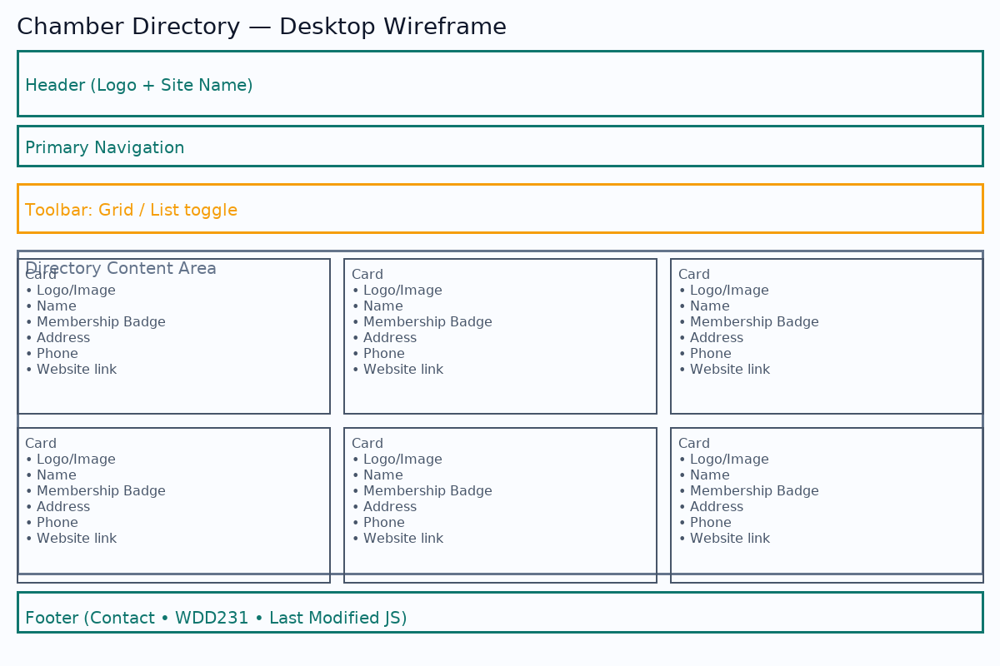
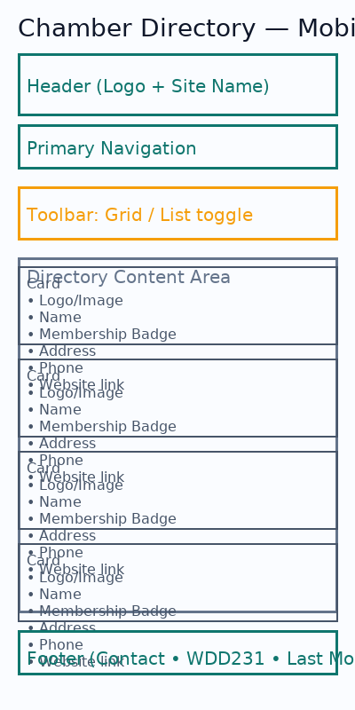

# Thornaby & Stockton Chamber of Commerce — Site Plan

## Site Purpose
A resource hub for local businesses: events, networking, member directory, and shop-local initiatives to promote economic growth.

## Target Market
- Local business owners and managers
- Residents and newcomers
- Regional partners and investors

## Site Goals
- Grow membership and event participation
- Provide a high-quality, searchable member directory
- Improve chamber reputation with useful resources and news

## Personas
- **Small Business Owner (Maria, 35):** Needs networking and marketing exposure.
- **Corporate Exec (Diego, 47):** Interested in partnerships, workforce, growth.
- **New Resident (Francisco):** Wants services, events, and area overview.

## Scenarios
- Learn about membership benefits and join
- Browse upcoming events and register
- Explore business climate and quality of life

## SEO Plan
- Intent keywords in titles/descriptions
- Verify Google Business Profile
- Backlinks from member sites
- GA snippet (later in course)

## Design Brief
- **Primary:** #0F766E (teal)
- **Secondary:** #F59E0B (amber)
- **Background:** #F8FAFC
- **Text:** #0F172A
- **Font:** Inter (headings), system-ui (body)

## Site Map
- Home, Discover, **Directory**, Join

## Wireframe Notes
- Directory: toolbar (Grid/List), responsive cards (logo, name, address, phone, link), membership badge.

## Wireframes

**Desktop**

**Mobile**

